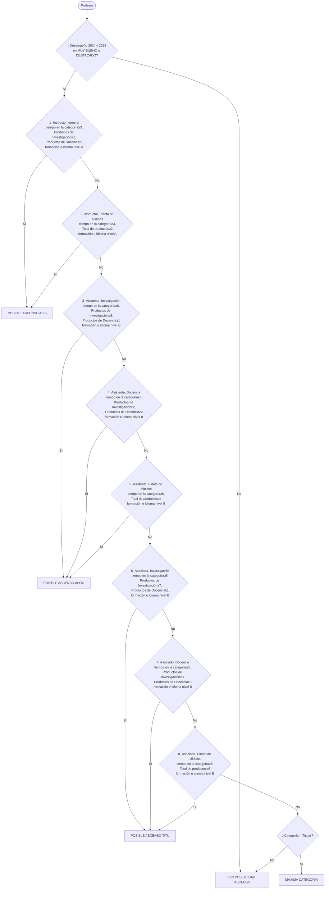
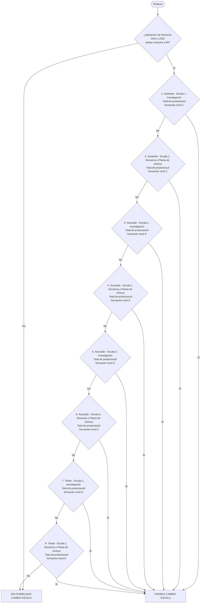

# Cómo evalúa `reglas.py`

Diagramas del orden exacto en que `evaluar_promocion()` y
`evaluar_escala_intermedia()` recorren sus listas de reglas: de arriba hacia
abajo, gana la **primera** que aplique. Si ninguna aplica, cae en el
resultado por defecto.

## Promoción

## Escala Intermedia

## Qué es cada "nivel" de formación/idioma

Para no repetir las mismas cuatro listas en cada casilla del diagrama, se
agrupan así (nombres tal cual en `reglas.py`):

| Nivel | Formación válida | Idioma válido |
|---|---|---|
| A (reglas 1-2, Instructor) | Maestría, Especialización Clínica Médica, Doctorado | B1, B2, C1, C2 |
| B (reglas 3-8, Asistente/Asociado → siguiente categoría) | Subespecialización Clínica Médica, Doctorado | B2, C1, C2 |
| C (reglas 1-2 de Escala, Asistente-Escala 1) | Maestría, Especialización Clínica Médica | — (no aplica idioma) |
| D (reglas 3-8 de Escala, Asociado/Titular) | Subespecialización Clínica Médica, Doctorado | — (no aplica idioma) |

Nota: los cortes "Investigación / Docencia / Planta de clínicos" corresponden
al campo `Actividad Preponderante` del profesor — hoy esa columna no tiene
fuente en ningún archivo (ver `COMO_FUNCIONA.md`), así que en la práctica
casi ninguna regla logra aplicar todavía.
